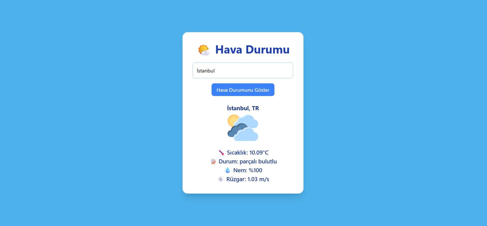

# 🌤️ Weather App

A simple and responsive weather application that fetches real-time weather data using the OpenWeatherMap API.

## 📸 Preview



## 🚀 Features

- Search weather by city name
- Displays temperature in Celsius
- Shows weather description
- Displays humidity and wind speed
- Dynamically changes weather icon based on condition
- User-friendly and responsive design

## 🛠️ Technologies Used

- HTML5
- JavaScript (ES6 - Async/Await)
- Tailwind CSS
- OpenWeatherMap API

## 📦 Project Structure

WeatherAppProject/
│
├── index.html
├── script.js
└── images/
    ├── gunesli.png
    ├── bulutlu.png
    ├── kapali.png
    ├── karli.png
    ├── preview.png
    └── yagmurlu.png


## 🔑 API

This project uses the OpenWeatherMap API to fetch real-time weather data.

To run this project, you need to:

1. Get your own API key from:
   https://openweathermap.org/api
2. Replace the API key inside `script.js`:

```javascript
const apiKey = "YOUR_API_KEY";
